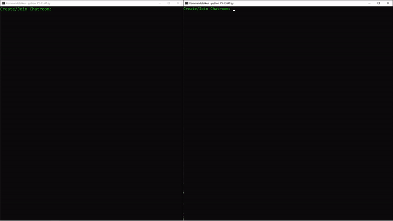

# PY-CHAT
Create or join a private chatroom without any third-party middlemen in less than 30 seconds, available through an AES encrypted password protected link.

## Download
1. Download PY-CHAT.zip [here](https://github.com/Wans1e/PY-CHAT/releases/download/Release/PY-CHAT.zip)
2. Unzip PY-CHAT.zip
3. Double-click PY-CHAT

## Usage
**Creating a chatroom**
1. Enter "Create"
2. Enter your address
    * Example: localhost
    * Example: localhost:5555
3. Enter your forwarded port address (optional)
    * Example: 2.tcp.eu.ngrok.io:18413
4. Choose your chatroom password (hidden)
5. Save the chatroom link
6. Choose your username

**Joining a chatroom**
1. Enter "Join"
2. Paste the chatroom link
3. Enter the chatroom password (hidden)
4. Choose your username

## Features
* AES Encrypted Link
* TLS Encrypted Messages
* Forwarded Port Support
* Connect / Disconnect Notices

---

## Requirements
* [Python 3.8+](https://www.python.org/downloads/release/python-380/)
* cryptography
* curses

## Installation
* git clone https://github.com/Wans1e/PY-CHAT.git && cd cd PY-CHAT
* **Windows**
  * pip install cryptography pipwin && pipwin install curses
  * python PY-CHAT.py
* **Mac / Linux**
  * pip3 install cryptography curses
  * python3 PY-CHAT.py
